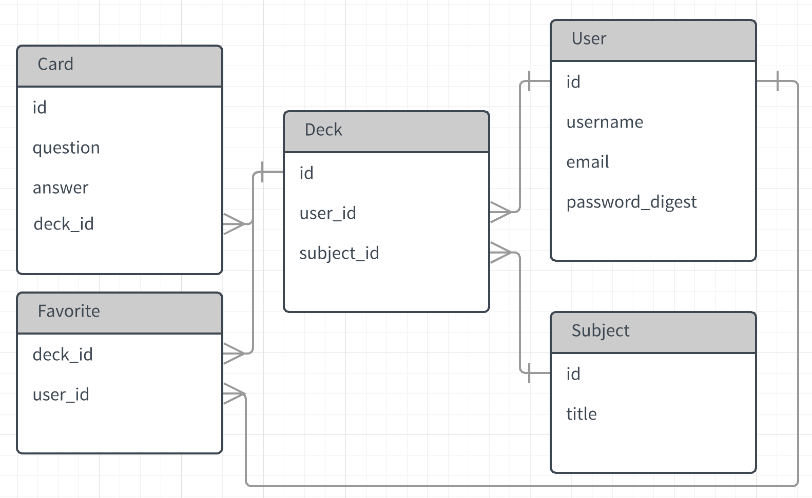

# Flashcardzzz

## Table of Contents
 * [User Story](#user-story)
 * [Technologies](#technologies)
 * [Installation](#installation)
 * [MVP](#mvp)
 * [Post-MVP](#post-mvp)
 * [Wireframe](#wireframe)
 * [ERD](#erd)
 * [Time Mangement](#time-management)
 * [Obstacles](#obstacles)
 * [Code Snippet](#code-snippet)
  
## Heroku Deployed Site


## Summary
Flashcardzzz is a flashcard application for people to create and learn about computer programming. If logged in, the user can read, create, edit, delete, and like flashcards. 

## User Story <a id="user-story"></a>
- On the landing page of the website, cards ordered by time added will be listed.

- A new user can register and a returning user can log in or log out. 

- On the home page after login, a personalized page will show the user's liked cards and created cards.

- CRUD:
- Create a card
- Read a card
- Edit a card
- Delete a card

- Like/unlike a card

## Technologies <a id="technologies"></a>
- React
- Rails
- Devise
- PostgreSQL
- Quizlet API

## Installation <a id="installation"></a>
- in client, npm start
- in rails, rails s

## MVP <a id="mvp"></a>
- Auth
- Layout
- CRUD

## Post MVP <a id="post-mvp"></a>
- Quizlet API
- Search bar
- User Profile
- Gamification
- Keydown controls L/R/flip
- Mobile: React Native

## Wireframe <a id="wireframe"></a>


## ERD <a id="erd"></a>



## Time Management <a id="time-management"></a>
| Component | Priority | Estimated Time | Time Invested | Actual Time |
| --- | :---: |  :---: | :---: | :---: |
| Setup Server |  | 1hr| 1hr | 1hr |
| CRUD (Rails/React) | H | 30hrs | 30hrs |  |
| API | H | 10hrs| 9hrs |  |
| Auth | H | 10hrs| 12hrs |  |
| Navigation | H | 10hrs | 10hrs |  |
| Styling | L | 5hrs| 8hrs |  |
|  |  | |  |  |
| Total |  | 70hrs | 69hrs |  |

## Obstacles <a id="obstacles"></a>
stuck on database for a long time
one error would take days to debug

## Code-snippet <a id="code-snippet"></a>
```

```