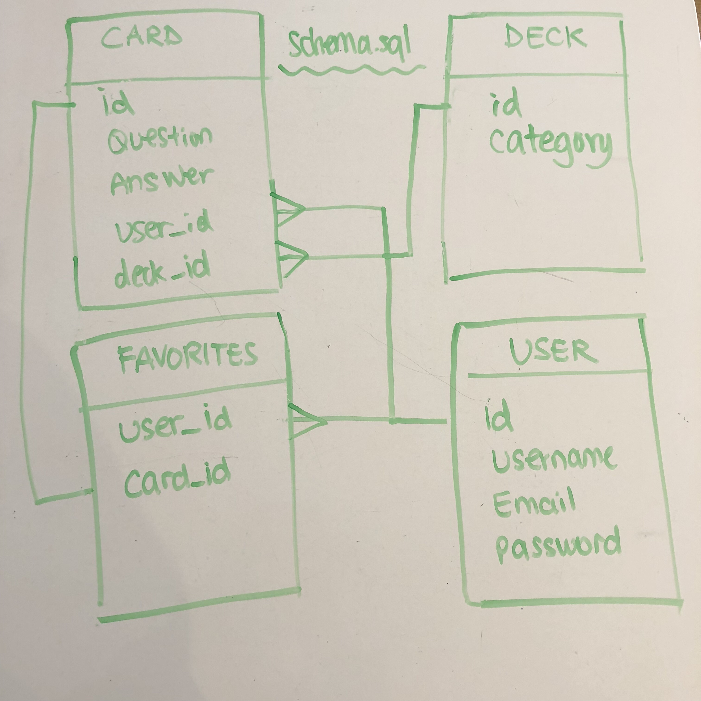

# Flashcardzzz


## Heroku Deployed Site


## Summary
Flashcardzzz is a flashcard application for people to create and learn about their favorite topics. If logged in, the user can create, edit, delete, and like flashcards. The user can search for categories powered by the Quizlet API to personalize their account.

## User Story
- On the landing page of the website, cards ordered by time added will be listed.

- A new user can register and a returning user can log in or log out. 

- On the home page after login, a personalized page will show the user's liked cards and created cards.

- CRUD
- Create a card
- Read a card in a deck
- Edit a card
- Delete a card
- Like/unlike a card

## Technologies
- React
- Rails
- Devise
- PostgreSQL
- Quizlet API

## Installation Instructions
- in client, npm start
- in rails, rails s

## MVP
- Quizlet API
- CRUD
- Auth
- Layout

## Post MVP
- Styling/ Animation
- Search bar
- User Profile
- Gamification
- Keydown controls L/R/flip
- Mobile: React Native

## Wireframe


## ERD


## Time Management
| Component | Priority | Estimated Time | Time Invested | Actual Time |
| --- | :---: |  :---: | :---: | :---: |
| Setup Server | H | 1hr| 1hr | 1hr |
| CRUD (Rails/React) | H | 30hrs |  |  |
| API | H | 10hrs| 12 |  |
| Auth | H | 10hrs|  |  |
| Login/register/logout | H | 10hrs |  |  |
| Styling | L | 5hrs|  |  |
| Favoriting |  | | | 10hrs |
|  |  | |  |  |
| Total |  | 75hrs |  |  |

## Obstacles


## code-snippet
```

```